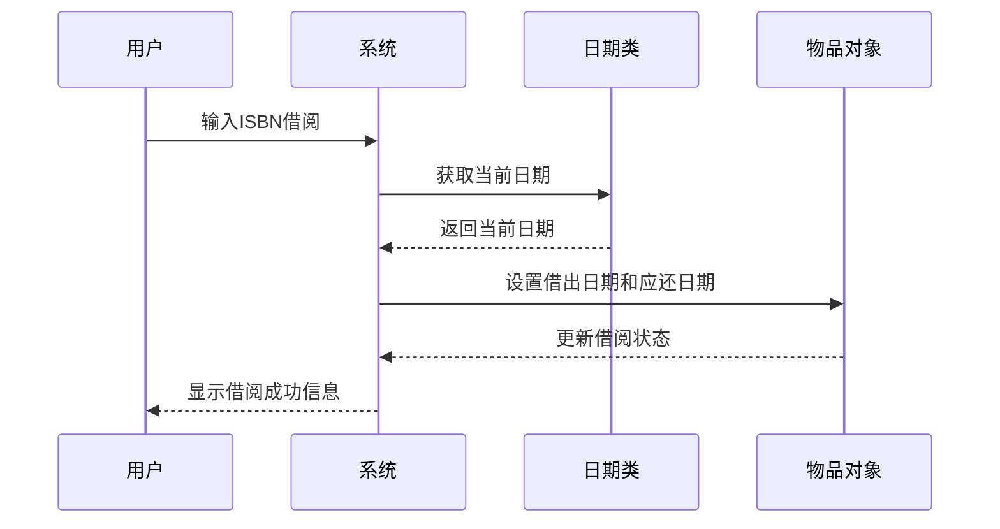
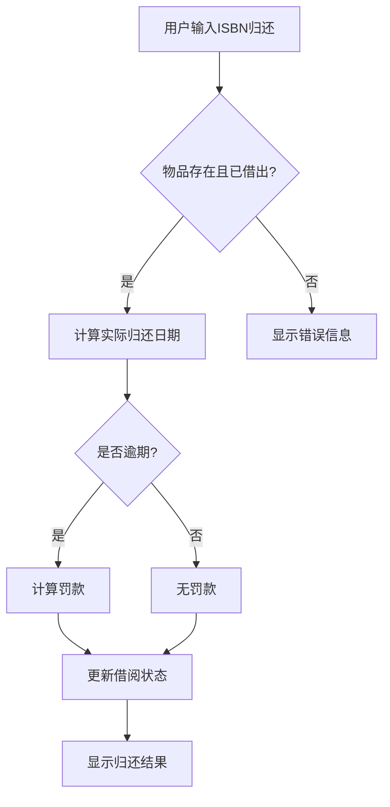
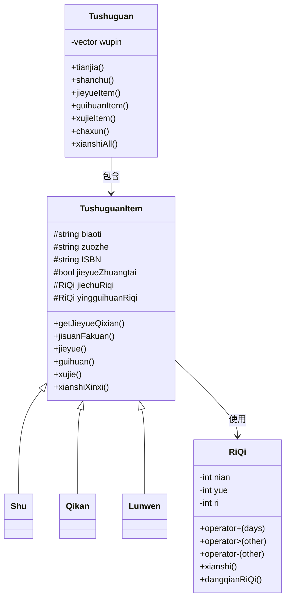

# 图书馆管理系统设计文档

## 1. 系统概述
本系统是一个简单的图书馆管理系统，支持图书、期刊和论文的管理。系统提供添加、删除、借阅、归还、续借、查询和展示功能，并实现了基于日期计算的逾期罚款机制。

## 2. 类设计

### 2.1 RiQi（日期类）
- **功能**：处理日期计算和比较
- **属性**：
    - `nian`：年
    - `yue`：月
    - `ri`：日
- **方法**：
    - `operator+`：计算指定天数后的日期
    - `operator>`：比较两个日期先后
    - `operator-`：计算两个日期相差天数
    - `xianshi()`：显示日期
    - `dangqianRiQi()`：获取当前系统日期（静态方法）
- **日期模型**：简化模型（每月30天，每年12个月）

### 2.2 TushuguanItem（图书馆物品基类）
- **功能**：定义图书馆物品的通用属性和行为
- **属性**：
    - `biaoti`：标题
    - `zuozhe`：作者
    - `ISBN`：ISBN号
    - `jieyueZhuangtai`：借阅状态
    - `jiechuRiqi`：借出日期
    - `yingguihuanRiqi`：应归还日期
- **方法**：
    - `getJieyueQixian()`：获取借阅期限（纯虚函数）
    - `jisuanFakuan()`：计算罚款（虚函数）
    - `jieyue()`：借阅操作
    - `guihuan()`：归还操作
    - `xujie()`：续借操作
    - `xianshiXinxi()`：显示物品信息

### 2.3 物品子类
| 类名   | 借阅期限 | 每日罚款 | 说明         |
|--------|----------|----------|--------------|
| Shu    | 30天     | 0.5元    | 图书类       |
| Qikan  | 14天     | 1.0元    | 期刊类       |
| Lunwen | 7天      | 2.0元    | 论文类       |

### 2.4 Tushuguan（图书馆管理系统类）
- **功能**：管理所有图书馆物品
- **属性**：
    - `wupin`：物品指针向量
- **方法**：
    - `tianjia()`：添加物品
    - `shanchu()`：删除物品
    - `jieyueItem()`：借阅物品
    - `guihuanItem()`：归还物品
    - `xujieItem()`：续借物品
    - `chaxun()`：查询物品
    - `xianshiAll()`：显示所有物品

### 2.5 用户界面
- `showMenu()`：显示主菜单
- `main()`：主程序逻辑，处理用户输入和系统交互

## 3. 核心功能流程

### 3.1 借阅流程


### 3.2 归还流程


## 4. 数据模型


## 5. 功能测试

后续将重复输出主菜单，为避免重复书写，这里先拷贝程序打印的主菜单：

```
===== 图书馆管理系统 =====
1. 添加图书
2. 删除图书
3. 借阅图书
4. 归还图书
5. 续借图书
6. 查询图书
7. 展示所有图书
8. 增加天数（测试）
9. 重置日期（测试）
0. 退出系统
========================
```


### 1.添加新期刊
```
请选择操作:1
 选择类型 (1.图书 2.期刊 3.论文):2
 输入标题:Cpp Textbook
 输入作者:CUMT
 输入ISBN:CUMT-1234
 添加成功!
```

### 2.借阅论文（逾期归还）

```
请选择操作:3
 输入要借阅的ISBN:CUMT-1234
 借阅成功! 借出日期: 2025-6-6

请选择操作:8
 输入要增加的天数:90
 当前日期已设置为: 2025-9-6
 
请选择操作:4
 输入要归还的ISBN:CUMT-1234
 归还成功! 逾期罚款: 76元
```

### 3.续借图书
```
请选择操作:3
 输入要借阅的ISBN:CUMT-1234
 借阅成功! 借出日期: 2025-9-6
 
（25天后）
请选择操作:8
 输入要增加的天数:15
 当前日期已设置为: 2025-9-21
 
请选择操作:5
 输入要续借的ISBN:CUMT-1234
 续借成功!
```

### 4.查询作者作品
```
请选择操作:6
 输入查询内容(书名/作者/ISBN):CUMT-1234
 标题: Cpp Textbook | 作者: CUMT | ISBN: CUMT-1234 | 状态: 已借出 (应还日期: 20
25-10-4)
```

### 5.删除期刊
```
请选择操作:2
 输入要删除的ISBN:CUMT-1234
 删除成功!
```

### 6.展示所有馆藏
```
请选择操作:7
 标题: C++ Primer | 作者: Stanley Lippman | ISBN: 978711548 | 状态: 可借阅
 标题: Science Journal | 作者: Nature | ISBN: SCI2023 | 状态: 可借阅
 标题: Deep Learning | 作者: Yann LeCun | ISBN: AI2024 | 状态: 可借阅
```