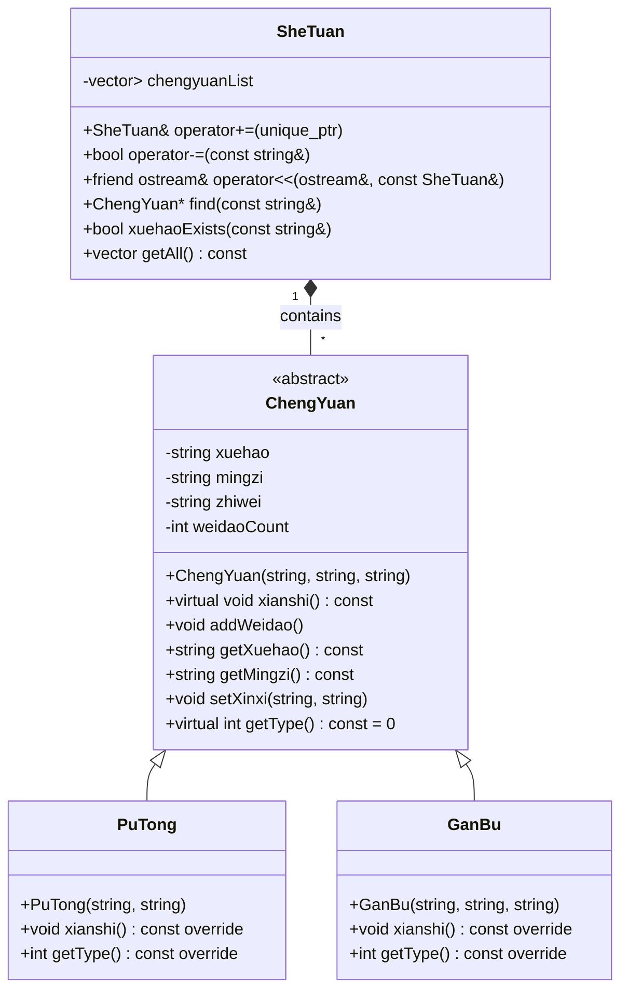

# 社团管理系统设计文档

## 1. 系统概述
本系统是一个社团成员管理系统，支持管理普通成员和干部信息，提供成员添加、删除、查询、修改、展示以及活动签到功能。系统使用C++实现，基于面向对象设计原则。

## 2. 类设计

### 2.1 基类 ChengYuan（成员）
- **属性**：
  - `xuehao`：学号（唯一标识）
  - `mingzi`：姓名
  - `zhiwei`：职位
  - `weidaoCount`：未到次数统计
- **方法**：
  - 构造函数：初始化成员基本信息
  - `xianshi()`：虚函数，展示成员信息
  - `addWeidao()`：增加未到次数
  - `getXuehao()/getMingzi()`：获取学号/姓名
  - `setXinxi()`：设置姓名和职位
  - `getType()`：纯虚函数，返回成员类型

### 2.2 派生类 PuTong（普通成员）
- 继承自ChengYuan
- 职位固定为"普通成员"
- 重写`xianshi()`：显示时添加"[普通]"前缀
- 重写`getType()`：返回类型标识1

### 2.3 派生类 GanBu（干部）
- 继承自ChengYuan
- 职位由构造函数指定
- 重写`xianshi()`：显示时添加"[干部]"前缀
- 重写`getType()`：返回类型标识2

### 2.4 社团管理类 SheTuan
- **核心数据结构**：
  - `vector<unique_ptr<ChengYuan>> chengyuanList`：成员集合
- **关键方法**：
  - `operator +=`：添加成员
  - `operator -=`：按学号删除成员
  - `operator <<`：输出所有成员（排序：干部优先，同类型按学号升序）
  - `find()`：按学号/姓名查找成员
  - `xuehaoExists()`：检查学号是否存在
  - `getAll()`：获取所有成员指针

## 3. 功能模块

### 3.1 成员管理
- **添加成员**：支持添加普通成员或干部
- **删除成员**：按学号删除
- **查询成员**：按学号或姓名模糊查询
- **修改成员**：修改姓名和职位（干部可修改职位）
- **展示成员**：按类型和学号排序显示

### 3.2 活动签到
1. 输入学号进行签到
2. 记录未到人员
3. 更新成员的未到次数
4. 显示未到人员列表（排序同成员展示）

### 3.3 用户界面
- 控制台菜单驱动界面
- 7个功能选项：
  ```
  1. 新增成员
  2. 删除成员
  3. 查询成员
  4. 修改成员
  5. 展示所有成员
  6. 活动签到
  0. 退出
  ```

## 4.数据模型



## 5.功能测试

### 1.添加成员
```
请选择:1
 输入学号:20230001
 输入姓名:张三 
 选择类型 (1-普通成员 2-干部):1
 添加成功!

请选择:1
 输入学号:2024001
 输入姓名:李四
 选择类型 (1-普通成员 2-干部):2
 输入干部职位:社长
 添加成功!
 
请选择:1
 输入学号:2025001
 输入姓名:王五
 选择类型 (1-普通成员 2-干部):2
 输入干部职位:副社长
 添加成功!
```

### 2.活动签到
```
请选择:6

==== 活动签到 ====
输入学号签到 (exit结束)
>2023001
 未找到成员，请重新输入
>2024001
 李四 签到成功
>2025001
 王五 签到成功
>exit

==== 未到人员 ====
[普通] 20230001    张三      普通成员  缺席:1次
```

### 3.修改成员
```
请选择:3
 输入学号或姓名:李四
 ==== 查询结果 ====
[干部] 2024001     李四      社长      缺席:0次

请选择:4
 输入要修改的学号:20230001
 输入新姓名 (留空不修改):张三点一四
 修改成功!

请选择:3
 输入学号或姓名:张三
 ==== 查询结果 ====
[普通] 20230001    张三点一四普通成员  缺席:1次
```

### 4.删除成员
```
请选择:2
 输入要删除的学号:20230001
 删除成功
 
请选择:5
 ======== 社团成员列表 ========
[干部] 2024001     李四      社长      缺席:0次
[干部] 2025001     王五      副社长    缺席:0次
```

### 5.错误处理测试
```
// 添加重复学号成员
请选择:1
 输入学号:2024001
 学号已存在!
 
// 签到/修改/删除不存在的学号成员
请选择:2
 输入要删除的学号:2023001
 成员不存在
```