# 图形计算器

## 程序概述
这是一个基于命令行的图形计算器程序，使用C++编写。程序允许用户创建和管理多种几何图形（圆形、椭圆、矩形、三角形），计算图形的面积和周长，操作结果会同步记录到日志文件中。程序设计有面向对象考量，深入采用了多态、运算符重载等技术。

## 功能特点
1. **多图形支持**：
   - 圆形：需要输入半径
   - 椭圆：需要输入长半轴和短半轴
   - 矩形：需要输入宽度和高度
   - 三角形：需要输入三条边长

2. **计算功能**：
   - 计算单个图形的面积
   - 计算单个图形的周长
   - 将两个图形的面积相加

3. **数据管理**：
   - 创建新图形
   - 查看所有已创建的图形
   - 图形索引管理

4. **日志记录**：
   - 自动记录所有计算操作
   - 包含时间戳和计算结果
   - 保存到"rilog.txt"文件

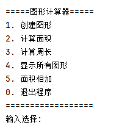

## 关键实现

### 1. 类体系设计
程序使用面向对象设计，通过基类和派生类实现多态：

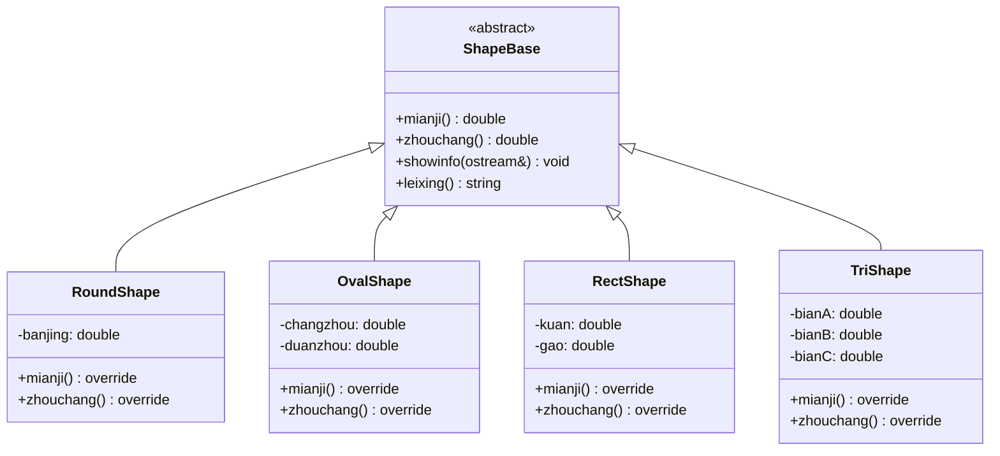

### 2. 运算符重载
程序实现了两个重要的运算符重载：

```cpp
// 输出运算符重载
ostream& operator<<(ostream& out, const ShapeBase& s) {
    s.showinfo(out);
    return out;
}

// 加法运算符重载（面积相加）
double operator+(const ShapeBase& a, const ShapeBase& b) {
    return a.mianji() + b.mianji();
}
```

### 3. 日志系统
日志功能记录所有计算操作：

```cpp
void writelog(const string& what, double num) {
    ofstream logfile("rilog.txt", ios::app);
    if (logfile) {
        time_t now = time(0);
        tm* timenow = localtime(&now);
        logfile << "[" << put_time(timenow, "%Y-%m-%d %H:%M:%S") << "] "
                << what << ": " << fixed << setprecision(2) << num << endl;
    }
}
```

### 4. 菜单系统
程序采用两级菜单设计：
- **主菜单**：提供核心功能选择
- **图形菜单**：选择要创建的图形类型

## 使用示例

### 1. 创建圆形

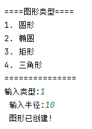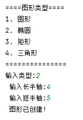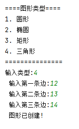

### 2. 计算面积

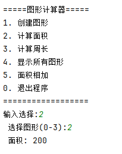

### 3. 面积相加

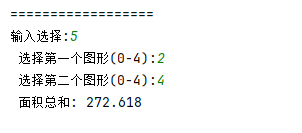

### 4. 查看所有图形

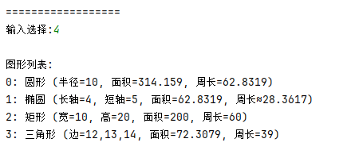

## 异常处理
程序包含基本的数据验证：
- 图形参数必须大于0
- 三角形边长必须满足三角不等式
- 索引选择必须在有效范围内

当输入无效数据时，程序会显示错误信息：

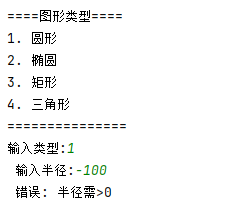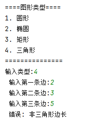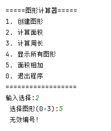

## 日志文件格式
日志文件"rilog.txt"包含时间戳、操作类型和结果：

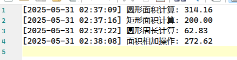
