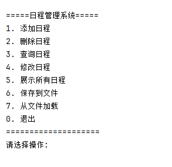
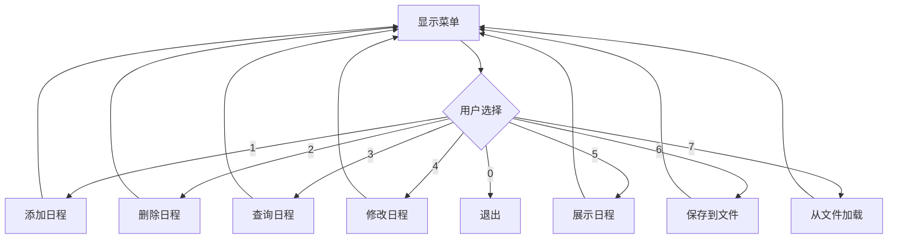
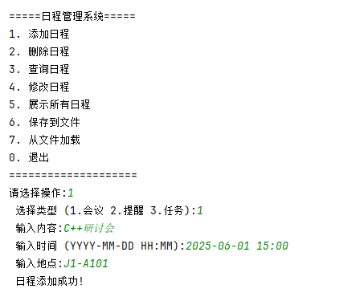
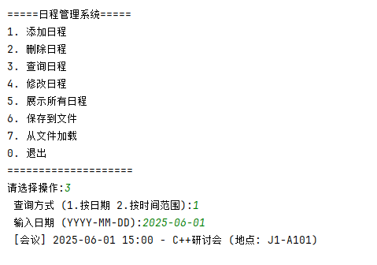
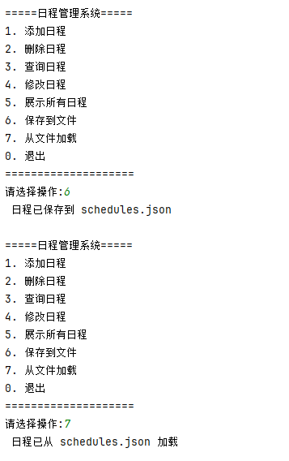
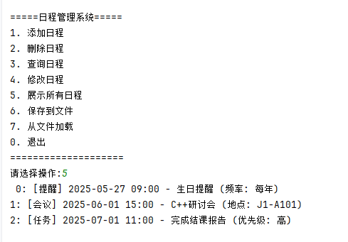
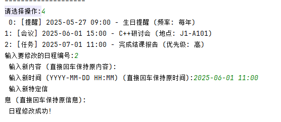
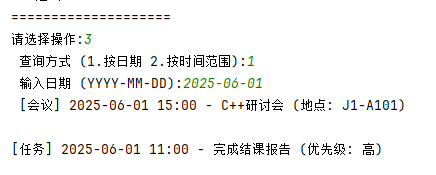
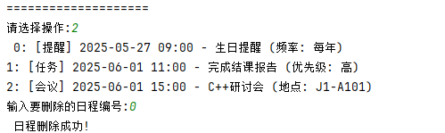

# 日程管理系统

## 功能概述

日程管理系统是一个基于命令行的日程管理系统，使用C++编写，仅依赖标准库实现，可以仅通过简单的交互很方便的实现日程管理。程序设计深入践行了OOP面向对象编程思想，深度应用多态、运算符重载等技术。

1. **日程管理**

   基本的日程管理功能

   - 添加会议、提醒和任务三种类型的日程
   - 删除指定日程
   - 修改现有日程内容
   - 查询指定日期或时间范围内的日程
   - 按时间顺序展示所有日程

2. **数据持久化**

   日程管理系统实现了json序列化和反序列化用于存储用户的日程

   系统默认使用`schedules.json`文件存储数据，首次运行会自动创建该文件。

   - 将日程保存到JSON文件
   - 从JSON文件加载日程数据

3. **用户交互**

   - 命令行菜单界面



## 关键技术实现

### 1. 面向对象设计

```cpp
class ScheduleA { // 基类
protected:
    std::string leixing; // 类型
    std::string xinxi;   // 内容
    std::time_t shijian; // 时间
    // ...
};

class MeetingA : public ScheduleA { // 会议类
    std::string didian; // 地点
    // ...
};

class ReminderA : public ScheduleA { // 提醒类
    std::string pinlv; // 频率
    // ...
};

class TaskA : public ScheduleA { // 任务类
    std::string youxianji; // 优先级
    // ...
};
```

- 使用多态处理不同类型的日程
- 派生类实现特有属性和行为

### 2. 运算符重载

```cpp
// 重载<运算符用于排序
bool operator<(const ScheduleA& aa) const {
    return shijian < aa.shijian;
}

// 重载<<运算符用于输出
friend std::ostream& operator<<(std::ostream& os, const ScheduleA& ss) {
    // 格式化时间输出
    // 调用多态方法输出特有信息
}
```

### 3. JSON文件处理

**保存到JSON：**

```cpp
void saveJ(const std::string& fn) {
    std::ofstream ff(fn);
    ff << "[\n";
    for (size_t i = 0; i < rcb.size(); ++i) {
        ff << rcb[i]->toJ(); // 调用多态方法
        if (i < rcb.size() - 1) ff << ",";
    }
    ff << "]\n";
}
```

**从JSON加载：**

```cpp
void loadJ(const std::string& fn) {
    std::ifstream ff(fn);
    // 解析JSON字符串
    while ((p = js.find('{', p)) != std::string::npos) {
        // 提取字段
        if (ff["type"] == "会议") {
            // 创建会议对象
        } 
        // 其他类型处理...
    }
}
```

### 4. 时间处理

```cpp
// 时间解析
static std::time_t parseT(const std::string& dt){
    std::tm tm = {};
    std::istringstream ss(dt);
    ss >> std::get_time(&tm, "%Y-%m-%d %H:%M");
    return std::mktime(&tm);
}

// 时间格式化
static std::string formatT(const std::time_t t){
    char bf[20];
    std::strftime(bf, sizeof(bf), "%Y-%m-%d %H:%M", std::localtime(&t));
    return bf;
}
```

### 5. 用户交互流程



## 使用示例

1. ### 添加会议日程

   

2. ### 查询日程

   


3. ### 保存/加载数据



### 4.展示所有日程



### 5.修改日程



### 6.查询日程



### 7.删除日程


