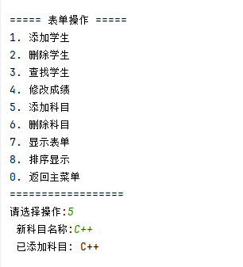

# 学生成绩管理系统文档

## 概述
这是一个基于C++的命令行学生成绩管理系统，采用模块化设计，完全通过命令行菜单界面交互，支持多表单管理和数据的持久化存储（CSV文件导入导出）。系统实现上采用面向对象设计，实现了多态和运算符重载等C++特性。

## 主要功能

### 1. 管理系统
- 创建新表单
- 删除已有表单
- 查看表单列表
- 从CSV文件导入数据
- 将表单导出为CSV文件
- 

### 2. 表单操作
- 添加学生记录
- 删除学生记录
- 查找学生（按姓名或学号）
- 修改学生单科成绩
- 添加新科目
- 删除现有科目
- 展示表单
- 排序表单展示
- 

### 3. 数据展示
- 表格形式展示表单
- 按姓名、学号、总分或科目排序
- 显示总分和平均分
- 

## 关键实现

### 1. 类结构设计


### 2. 多态实现
`shujuxiang`基类定义了通用接口，`xuesheng`类实现具体功能：
```cpp
virtual void xianshi() const override {
    cout << left << setw(15) << xingming << setw(15) << xuehao;
    // ... 显示成绩信息
}

virtual string geshihuacsv() const override {
    ostringstream oss;
    oss << xingming << "," << xuehao;
    // ... 格式化为CSV行
}
```

### 3. 运算符重载
学生类重载`==`运算符，用于比较学号：
```cpp
bool operator==(const xuesheng& o) const {
    return xuehao == o.xuehao;
}
```

### 4. CSV处理
导入CSV文件时解析表头和数据行：
```cpp
// 解析表头
kemulist = vector<string>(headers.begin() + 2, headers.end());

// 处理数据行
xuesheng xs(rowData[0], rowData[1]);
for (int i = 0; i < kemulist.size(); i++) {
    double f = stod(rowData[i + 2]);
    xs.xiugaicj(kemulist[i], f);
}
```

### 5. 排序功能
使用lambda表达式实现多种排序方式：
```cpp
sort(xueshenglist.begin(), xueshenglist.end(),
    [&](const xuesheng& a, const xuesheng& b) {
        return asc ? a.huodehao() < b.huodehao() 
                  : a.huodehao() > b.huodehao();
    });
```

## 使用示例

### 创建表单


### 删除表单


### 添加学生


### 删除学生


### 添加科目



### 删除科目


### 修改成绩


### 表单展示


### 排序展示


### 导出csv


### 导入CSV


