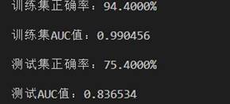
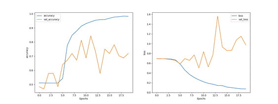
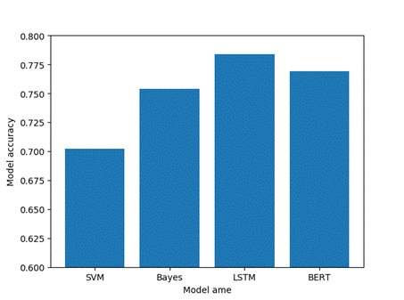
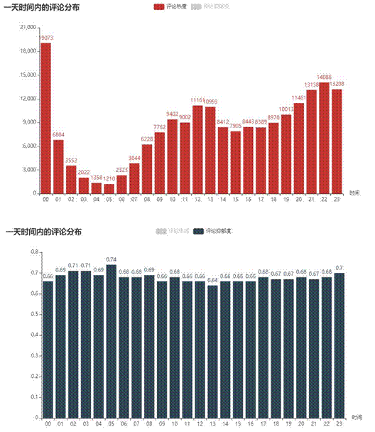

# 网易云音乐大数据系统调试报告

## 准备运行环境

复制解压项目文件，在`Pycharm`中以项目打开

以 Python3.12 创建 `venv` 解释器环境

### 安装必备Python第三方库

#### 在命令行运行如下命令

```pipbash
pip install pandas
pip install py2neo
pip install scikit-learn
pip install jieba
pip install tensorflow
pip install tensorflow-hub
pip install tf-models-no-deps
pip install matplotlib
pip install pyecharts
pip install pyspark
pip install gensim
pip install xlrd
```

#### 直接按照笔者整理的环境清单配置

```
pip install -r requirments.txt
```

### 安装Neo4j

在neo4j官网下载对应操作系统的包

由于推荐的neo4j-3.5.22已经是失去支持的版本，笔者这里采用neo4j-community-3.5.31替代，避免产生太多兼容错误，同时尽可能最新

注意这个版本的neo4j需要设备已经预装jre1.8.0即JAVA8

解压到合适的位置，并将/bin配置到系统PATH后重启设备

在命令行运行以下命令启动neo4j

```
neo4j.bat console
```

随后命令行输出

> 2025-06-02 13:44:33.805+0000 INFO  Starting...
> 2025-06-02 13:44:38.104+0000 INFO  Bolt enabled on 127.0.0.1:7687.
> 2025-06-02 13:44:39.527+0000 INFO  Started.
> 2025-06-02 13:44:40.425+0000 INFO  Remote interface available at http://localhost:7474/
> 2025-06-02 13:45:08.182+0000 WARN  The client is unauthorized due to authentication failure.

访问http://localhost:7474/ 以默认账号密码neo4j登录，进入后强制修改密码，修改密码为123456，配置完成

### 对文件结构进行整理

考虑到项目的条理性，同时由于系统无法处理过长的路径，处理中文字符路径时可能会遇到问题，笔者重新对项目文件进行如下整理：

```
BigDataCaseNetcloud
├─1爬虫及数据存储			#->/spider
├─2原始数据TXT			  #->/data/origin
├─3图数据库				  #->/data/database
├─4网易云大数据分析		   #->/data_anal
└─5网抑云评论情感分析	   #->/emotion_anal
   └─已标注的数据集		#->/data/marked
```

目前项目结构如下：

```
BigDataCaseNetcloud
├─data				#数据
│  ├─database		#图数据库
│  ├─marked			#标注数据集
│  └─origin			#原始数据txt
├─data_anal			#数据分析代码
├─emotion_anal		#情感分析
└─spider			#爬虫代码
```

## 爬虫程序调试

### clu_main1.py

重定义输出位置，并创建output文件夹，以避免污染原本自带的数据集

```python
output = "./output"
```

修改main中文件打开

```python
singer_file = open(output+'/singers.txt', 'w', encoding='utf-8')
song_file = open(output+'/songs.txt', 'w', encoding='utf-8')
comment_file = open(output+'/comments.txt', 'w', encoding='utf-8')
simi_file = open(output+"/similar.txt", 'w', encoding='utf-8')
```

修正获取地址为公开的网易云音乐 Node.js API服务

```
prefix = 'http://163api.qijieya.cn/'
```

运行代码，代码如期运行

由于爬虫完整爬取案例所需数据需要非常长的时间、占用较多的网络公共资源，后续处理将采取案例内附数据

### convert.py

本代码可以筛选出用于打标签的评论数据集

同理定义data和output位置

```
data_path = "../data/origin"
output_path = "../output"
```

同时对所有文件读取写入位置做对应修改

这个脚本需要手动修改main函数内容来改变运行方式

当修改为main1()时该脚本会对评论进行清洗（解析json并整理感兴趣内容）

当修改为main2()时该脚本会对清洗后的数据打标签整理.xlsx表格文档

因此，先后运行该代码两个模式，main1()会正常运行

当运行main2()时遇到如下报错：

> TypeError: NDFrame.to_excel() got an unexpected keyword argument 'encoding'

这是因为高版本pandas取消了to_excel()方法的参数encoding，做如下修改，改用to_csv（）进行存储，同样可以避免符号问题

```python
t = []
i = 0
for item in res:
    t.append(item)
    if len(t) >= 500:
        i += 1
        data = pandas.DataFrame(t)
        data.to_csv(output_path+"/comments_excel{}.csv".format(i), index=False, encoding='utf-8')
        t.clear()
i += 1
data = pandas.DataFrame(t)
data.to_csv(output_path+"/comments_excel{}.csv".format(i), index=False, encoding='utf-8')
t.clear()
```

### db_in.py

照例写入data和ouput路径，将读入重定向到上一步刚输出结果的output

从这一步开始需要配置neo4j，修改为如下链接

```python
Graph("bolt://localhost:7687", auth=("neo4j", "123456"))
```

这里main函数少调用一个方法，需要修改为：

```python
if __name__ == '__main__':
    insert_singers()
    insert_songs()
```

同时songs点插入存在值类型错误的问题，需要进行清洗

```python
def clean_node_properties(data):
    """确保所有属性值都是 Neo4j 支持的基本类型"""
    cleaned = {}
    for key, value in data.items():
        # 处理 None 值
        if value is None:
            cleaned[key] = ""  # 转换为空字符串
        # 处理字典和列表
        elif isinstance(value, (dict, list)):
            # 将复杂类型转换为 JSON 字符串
            cleaned[key] = json.dumps(value, ensure_ascii=False)
        # 处理其他非原始类型
        elif not isinstance(value, (str, int, float, bool)):
            # 转换为字符串表示
            cleaned[key] = str(value)
        else:
            # 原始类型直接保留
            cleaned[key] = value
    return cleaned
```


### find_user.py

用于从评论数据集获取用户id集合

修改写入data和ouput路径，修改文件路径，即可正常运行

```python
data_path = "../data/origin"
output_path = "../output"

if __name__ == '__main__':
    file = open(data_path+"/comments_1.txt", encoding="utf-8")
    out_file = open(output_path+"/userIds.txt", mode="w")
```

### get_user_info.py

需要用到find_user.py生成的userIds.txt

重定向路径，修改API地址，即可跑通

```python
url = "http://163api.qijieya.cn/user/detail?uid={}".format(userId)
file = open(output_path+"/userIds.txt")
out_file = open(output_path+"/userCities.txt", mode="w")
```

需要注意如果这一步采用案例附带的数据，部分用户可能无法正常查询到

### write_database.py

有三份程序，分别向neo4j图数据库写入歌手与歌曲信息、歌曲的相似信息、Comment与user信息

重定向路径，修改数据库地址，即可跑通

## 数据分析调试

### FansDistribution.py

首先需要修改pyecharts导入方式

```python
from pyecharts.charts import Bar, Map, Geo
```

修改文件打开方式

```python
data_path = "../data/origin"
output_path = "../output"
prefix = 'http://163api.qijieya.cn/'
f1 = open(data_path+'/songs.txt','r',encoding = "utf-8")
f2 = open(data_path+'/comments_1.txt','r',encoding = "utf-8")
```

由于pyecharts升级，展示语法仍然需要修改：

同时调用真实的数据进行展示

```python
# 1. 获取歌手的所有歌曲ID
    songList = get_singerSongs(singerName)
    print(f"找到歌曲数量: {len(songList)}")

    # 2. 获取这些歌曲的评论用户
    fansList = get_comments_users(songList)
    print(f"获取用户数量: {len(fansList)}")

    # 3. 获取粉丝地区分布
    fansDist = get_fans_distribution(fansList)
    print("粉丝地区分布:")
    for province, count in fansDist.items():
        print(f"{province}: {count}")

    # 4. 使用真实数据绘制地图
    # 初始化地图
    map_chart = Map(init_opts=opts.InitOpts(
        width="1000px",
        height="800px",
        bg_color="#404a59"
    ))

    # 准备数据对
    data_pair = [(province, count) for province, count in fansDist.items()]

    # 设置全局选项
    map_chart.set_global_opts(
        title_opts=opts.TitleOpts(
            title=f"{singerName}粉丝地区分布",
            subtitle="数据来源: 网易云音乐API",
            pos_left="center",
            title_textstyle_opts=opts.TextStyleOpts(color="#fff", font_size=20),
            subtitle_textstyle_opts=opts.TextStyleOpts(color="#ccc", font_size=14)
        ),
        visualmap_opts=opts.VisualMapOpts(
            min_=min(fansDist.values()),
            max_=max(fansDist.values()),
            is_piecewise=True,  # 分段显示
            range_text=["高", "低"],
            pos_left="10px",
            pos_bottom="20px",
            textstyle_opts=opts.TextStyleOpts(color="#ddd")
        ),
        tooltip_opts=opts.TooltipOpts(
            trigger="item",
            formatter="{b}: {c} 人"
        )
    )

    # 添加数据系列
    map_chart.add(
        series_name="粉丝数量",
        maptype="china",
        data_pair=data_pair,
        is_map_symbol_show=False,  # 不显示标记点
        label_opts=opts.LabelOpts(
            is_show=True,
            color="#333",
            formatter="{b}: {c}"
        ),
        itemstyle_opts=opts.ItemStyleOpts(
            border_color="#111",
            border_width=0.5
        )
    )

    # 设置系列特效选项
    map_chart.set_series_opts(
        markpoint_opts=opts.MarkPointOpts(
            symbol="pin",
            symbol_size=40,
            label_opts=opts.LabelOpts(
                formatter="{b}: {c}",
                color="#fff",
                position="inside"
            )
        )
    )

    # 渲染地图
    output_file = f"{output_path}/{singerName}_fans_distribution.html"
    map_chart.render(output_file)
    print(f"地图已保存为: {output_file}")

    # 关闭文件
    f1.close()
    f2.close()
```

笔者对这段数据展示进行了重写处理，目前可以跑通，但是原文代码的爬取数据可能涉及API限制问题

### FansRights.py

笔者对这段代码做了完全的重构，以实现预定的功能

```python
import json
import numpy as np
from pyecharts.charts import Pie
from pyecharts import options as opts
from collections import defaultdict

data_path = "../data/origin"
output_path = "../output"
prefix = 'http://163api.qijieya.cn/'


# 获取歌手所有歌曲
def get_singerSongs(singerName):
    songsList = []
    with open(f"{data_path}/songs.txt", 'r', encoding="utf-8") as f:
        for line in f:
            song_data = json.loads(line)
            # 检查歌手信息是否存在
            if 'ar' in song_data and len(song_data['ar']) > 0:
                if song_data['ar'][0]['name'] == singerName:
                    songsList.append(song_data['id'])
    return songsList


# 获取不同类型的粉丝数
def get_fansRights(songList):
    # 使用集合存储用户ID，确保唯一性
    all_users = set()
    vip_users = set()

    with open(f"{data_path}/comments_2.txt", 'r', encoding="utf-8") as f:
        for line in f:
            comment = json.loads(line)
            if comment['song_id'] in songList:
                user_id = comment['user']['userId']
                all_users.add(user_id)

                # 更准确的VIP判断
                if 'vipRights' in comment['user'] and isinstance(comment['user']['vipRights'], dict):
                    vip_users.add(user_id)

    # 计算普通用户数
    regular_count = len(all_users) - len(vip_users)
    return [regular_count, len(vip_users)]


if __name__ == '__main__':
    singerName = "毛不易"

    # 获取歌手的所有歌曲ID
    songList = get_singerSongs(singerName)
    print(f"找到 {len(songList)} 首歌曲")

    # 获取粉丝统计数据
    fan_counts = get_fansRights(songList)
    print(f"普通粉丝: {fan_counts[0]}, VIP粉丝: {fan_counts[1]}")

    # 创建饼图
    pie = Pie()
    pie.add(
        series_name="粉丝类型",
        data_pair=[
            ("普通粉丝", fan_counts[0]),
            ("VIP粉丝", fan_counts[1])
        ],
        radius=["30%", "70%"],
        center=["50%", "50%"],
        label_opts=opts.LabelOpts(is_show=True, formatter="{b}: {c} ({d}%)")
    )

    pie.set_global_opts(
        title_opts=opts.TitleOpts(
            title=f"歌手粉丝类别 - {singerName}",
            subtitle=f"总计粉丝数: {sum(fan_counts)}"
        ),
        legend_opts=opts.LegendOpts(
            orient="vertical",
            pos_left="left"
        )
    )

    pie.render("singer_fans.html")
    print("图表已生成: singer_fans.html")
```

### SingerHot.py

这段代码主要是为了展示歌手毛不易的热度，笔者进行了重写

```python
import json
import os
import datetime
import numpy as np
import matplotlib.pyplot as plt
from pyecharts import options as opts
from pyecharts.charts import Line
from collections import defaultdict
from matplotlib import font_manager

# 设置数据路径
data_path = "../data/origin"
output_path = "../output"


# 模拟SongsHot模块的函数（实际项目中应替换为真实实现）
class SongsHot:
    @staticmethod
    def get_commentsCount(song_id):
        """模拟获取歌曲评论数（按日期）"""
        # 实际项目中应替换为真实API调用
        # 这里返回模拟数据
        days = 30
        base_date = datetime.date.today() - datetime.timedelta(days=days)
        comments_data = []
        for i in range(days):
            date_str = (base_date + datetime.timedelta(days=i)).strftime("%Y-%m-%d")
            # 生成随机但递减的数据
            count = max(100, 500 - i * 10 + np.random.randint(-20, 30))
            comments_data.append([date_str, count])
        return comments_data

    @staticmethod
    def get_likedCount(song_id):
        """模拟获取歌曲点赞数（按日期）"""
        # 实际项目中应替换为真实API调用
        days = 30
        base_date = datetime.date.today() - datetime.timedelta(days=days)
        likes_data = []
        for i in range(days):
            date_str = (base_date + datetime.timedelta(days=i)).strftime("%Y-%m-%d")
            # 生成随机但递减的数据
            count = max(50, 300 - i * 5 + np.random.randint(-15, 25))
            likes_data.append([date_str, count])
        return likes_data

    @staticmethod
    def get_sumCount(comments_data, likes_data):
        """合并评论数和点赞数为热度值"""
        # 创建一个字典来按日期聚合数据
        date_dict = defaultdict(int)

        # 处理评论数据
        for date, count in comments_data:
            date_dict[date] += count * 0.7  # 评论权重为0.7

        # 处理点赞数据
        for date, count in likes_data:
            date_dict[date] += count * 0.3  # 点赞权重为0.3

        # 转换为列表并排序
        result = [[date, date_dict[date]] for date in date_dict]
        result.sort(key=lambda x: x[0])  # 按日期排序

        return result


# 获取歌手的所有歌曲
def get_singerSongs(singerName):
    songsList = []
    songs_file = os.path.join(data_path, 'songs.txt')

    if not os.path.exists(songs_file):
        print(f"警告: 歌曲文件不存在: {songs_file}")
        return songsList

    try:
        with open(songs_file, 'r', encoding='utf-8') as f:
            for line in f:
                try:
                    song_data = json.loads(line.strip())
                    # 检查是否有歌手信息
                    if 'ar' in song_data and song_data['ar'] and song_data['ar'][0]['name'] == singerName:
                        songsList.append(song_data['id'])
                except json.JSONDecodeError:
                    print(f"JSON解析错误: {line[:50]}...")
                    continue
    except Exception as e:
        print(f"读取歌曲文件时出错: {e}")

    return songsList


if __name__ == '__main__':
    singerName = "毛不易"

    # 获取歌手的所有歌曲
    songList = get_singerSongs(singerName)
    print(f"找到 {len(songList)} 首歌曲")

    # 如果没有找到歌曲，使用模拟数据
    if not songList:
        print("未找到歌曲，使用模拟歌曲ID")
        songList = [123456, 789012, 345678]  # 模拟歌曲ID

    # 初始化日期热度字典
    date_hot_dict = defaultdict(float)

    # 统计每首歌的热度
    for songid in songList:
        print(f"处理歌曲: {songid}")

        # 获取评论数据
        comments_data = SongsHot.get_commentsCount(songid)
        # 获取点赞数据
        likes_data = SongsHot.get_likedCount(songid)
        # 合并为热度值
        song_hot_data = SongsHot.get_sumCount(comments_data, likes_data)

        # 累加到总热度
        for date, hot_value in song_hot_data:
            date_hot_dict[date] += hot_value

    # 转换为列表并排序
    singer_HotSum = [[date, date_hot_dict[date]] for date in date_hot_dict]
    singer_HotSum.sort(key=lambda x: x[0])  # 按日期排序

    # 提取日期和热度值
    dates = [item[0] for item in singer_HotSum]
    hot_values = [item[1] for item in singer_HotSum]

    print("日期\t\t热度值")
    for date, value in zip(dates, hot_values):
        print(f"{date}\t{value:.2f}")

    # 创建折线图
    line = Line()
    line.add_xaxis(dates)
    line.add_yaxis(
        series_name="热度值",
        y_axis=hot_values,
        is_smooth=True,
        markpoint_opts=opts.MarkPointOpts(
            data=[
                opts.MarkPointItem(type_="max", name="最大值"),
                opts.MarkPointItem(type_="min", name="最小值"),
                opts.MarkPointItem(type_="average", name="平均值")
            ]
        ),
        markline_opts=opts.MarkLineOpts(
            data=[opts.MarkLineItem(type_="average", name="平均值")]
        ),
        label_opts=opts.LabelOpts(is_show=False),
        linestyle_opts=opts.LineStyleOpts(width=3),
        itemstyle_opts=opts.ItemStyleOpts(color="#d14a61"),
        areastyle_opts=opts.AreaStyleOpts(opacity=0.3, color="#d14a61")
    )

    line.set_global_opts(
        title_opts=opts.TitleOpts(
            title=f"{singerName}热度随时间变化",
            subtitle="数据来源: 网易云音乐",
            pos_left="center"
        ),
        tooltip_opts=opts.TooltipOpts(trigger="axis"),
        xaxis_opts=opts.AxisOpts(
            type_="category",
            axislabel_opts=opts.LabelOpts(rotate=45),
            name="日期"
        ),
        yaxis_opts=opts.AxisOpts(
            name="热度值",
            axislabel_opts=opts.LabelOpts(formatter="{value}"),
            splitline_opts=opts.SplitLineOpts(is_show=True)
        ),
        datazoom_opts=opts.DataZoomOpts(is_show=True, type_="slider"),
        legend_opts=opts.LegendOpts(is_show=False)
    )

    # 渲染图表
    output_file = os.path.join(output_path, f"{singerName}_hot_trend.html")
    line.render(output_file)
    print(f"图表已生成: {output_file}")

    # 设置中文字体支持
    try:
        # 尝试使用系统自带的中文字体
        font_list = font_manager.findSystemFonts(fontpaths=None, fontext='ttf')
        chinese_fonts = [f for f in font_list if any(
            keyword in f.lower() for keyword in ['simhei', 'simsun', 'microsoft yahei', 'noto sans cjk'])]

        if chinese_fonts:
            # 使用找到的第一个中文字体
            font_path = chinese_fonts[0]
            zh_font = font_manager.FontProperties(fname=font_path)
            plt.rcParams['font.family'] = zh_font.get_name()
        else:
            # 如果找不到中文字体，使用默认字体并显示警告
            print("警告: 未找到系统中文字体，图表中文可能显示为方块")
            plt.rcParams['font.family'] = 'sans-serif'

        # 确保负号正常显示
        plt.rcParams['axes.unicode_minus'] = False
    except Exception as e:
        print(f"设置中文字体时出错: {e}")
        # 回退到默认设置
        plt.rcParams['font.family'] = 'sans-serif'

    # 同时生成matplotlib图表作为备份
    plt.figure(figsize=(12, 6))
    plt.plot(dates, hot_values, 'o-', color='#d14a61', linewidth=2)
    plt.title(f"{singerName}热度随时间变化", fontsize=14)
    plt.xlabel("日期", fontsize=12)
    plt.ylabel("热度值", fontsize=12)
    plt.xticks(rotation=45)
    plt.grid(True, linestyle='--', alpha=0.7)
    plt.tight_layout()

    # 保存图片
    img_file = os.path.join(output_path, f"{singerName}_hot_trend.png")
    plt.savefig(img_file, dpi=300)
    print(f"备份图片已生成: {img_file}")
```

### SongsHot.py

这段代码了歌曲"一荤一素"的热度统计数据，同样进行了重写

```python
import json
import time
import operator
import pandas as pd
from collections import defaultdict
from pyecharts.charts import Line
from pyecharts import options as opts
from datetime import datetime

data_path = r"../data/origin"
output_path = "../output"


def get_song_data(music_id):
    """
    一次性读取所有相关数据，避免多次读取大文件
    返回: (评论计数, 点赞计数)
    """
    comments_count = defaultdict(int)
    liked_count = defaultdict(int)

    with open(data_path+"/comments_2.txt", 'r', encoding="utf-8") as f:
        for line in f:
            try:
                comment = json.loads(line)
                if comment['song_id'] == music_id:
                    # 转换时间戳为年月格式 (YYYYMM)
                    timestamp = comment['time'] // 1000
                    date_key = time.strftime("%Y%m", time.localtime(timestamp))

                    # 统计评论次数
                    comments_count[date_key] += 1

                    # 统计点赞总数
                    liked_count[date_key] += int(comment.get('likedCount', 0))
            except (json.JSONDecodeError, KeyError) as e:
                print(f"解析错误: {e}, 行内容: {line}")
                continue

    # 排序并转换为列表
    sorted_comments = sorted(comments_count.items(), key=operator.itemgetter(0))
    sorted_liked = sorted(liked_count.items(), key=operator.itemgetter(0))

    return sorted_comments, sorted_liked


def format_dates(date_keys):
    """将YYYYMM格式转换为更易读的格式 (YYYY年MM月)"""
    return [f"{d[:4]}年{d[4:]}月" for d in date_keys]


def create_line_chart(music_id, song_name):
    # 获取数据
    comments_data, liked_data = get_song_data(music_id)

    # 提取日期和数值
    dates = [item[0] for item in comments_data]
    comments_values = [item[1] for item in comments_data]
    liked_values = [item[1] for item in liked_data]

    # 计算热度值 = 评论数 + 点赞数
    hot_values = [c + l for c, l in zip(comments_values, liked_values)]

    # 格式化日期
    formatted_dates = format_dates(dates)

    # 创建折线图
    line = Line(
        init_opts=opts.InitOpts(width="1200px", height="600px")
    )

    # 添加三条线
    line.add_xaxis(formatted_dates)
    line.add_yaxis(
        "评论数",
        comments_values,
        is_smooth=True,
        markpoint_opts=opts.MarkPointOpts(
            data=[
                opts.MarkPointItem(type_="max", name="最大值"),
                opts.MarkPointItem(type_="min", name="最小值"),
            ]
        ),
        linestyle_opts=opts.LineStyleOpts(width=3),
        itemstyle_opts=opts.ItemStyleOpts(color="#5793f3")
    )

    line.add_yaxis(
        "点赞数",
        liked_values,
        is_smooth=True,
        markpoint_opts=opts.MarkPointOpts(
            data=[
                opts.MarkPointItem(type_="max", name="最大值"),
                opts.MarkPointItem(type_="min", name="最小值"),
            ]
        ),
        linestyle_opts=opts.LineStyleOpts(width=3, type_="dashed"),
        itemstyle_opts=opts.ItemStyleOpts(color="#d14a61")
    )

    line.add_yaxis(
        "热度值",
        hot_values,
        is_smooth=True,
        markpoint_opts=opts.MarkPointOpts(
            data=[
                opts.MarkPointItem(type_="max", name="峰值热度"),
                opts.MarkPointItem(type_="min", name="低谷热度"),
            ]
        ),
        linestyle_opts=opts.LineStyleOpts(width=4),
        itemstyle_opts=opts.ItemStyleOpts(color="#675bba")
    )

    # 设置全局选项
    line.set_global_opts(
        title_opts=opts.TitleOpts(
            title=f"歌曲《{song_name}》热度变化趋势",
            subtitle=f"数据统计周期: {formatted_dates[0]} 至 {formatted_dates[-1]}",
            pos_left="center"
        ),
        tooltip_opts=opts.TooltipOpts(trigger="axis"),
        toolbox_opts=opts.ToolboxOpts(
            is_show=True,
            feature={
                "saveAsImage": {},
                "dataView": {"readOnly": False},
                "restore": {},
                "dataZoom": {}
            }
        ),
        legend_opts=opts.LegendOpts(
            pos_top="5%",
            pos_left="center",
            orient="horizontal"
        ),
        yaxis_opts=opts.AxisOpts(
            name="数量",
            name_location="end",
            name_gap=15,
            axislabel_opts=opts.LabelOpts(formatter="{value} 次")
        ),
        xaxis_opts=opts.AxisOpts(
            name="时间",
            name_location="end",
            name_gap=30,
            axislabel_opts=opts.LabelOpts(rotate=45)
        )
    )

    # 生成HTML文件
    output_file = f"{output_path}/{song_name}_热度变化.html"
    line.render(output_file)
    print(f"图表已生成: {output_file}")

    # 返回数据用于调试
    return {
        "dates": dates,
        "comments": comments_values,
        "liked": liked_values,
        "hot": hot_values
    }


if __name__ == '__main__':
    # 歌曲信息
    song_id = 569200210  # 一荤一素
    song_name = "一荤一素"

    # 创建图表并获取数据
    data = create_line_chart(song_id, song_name)

    # 打印数据摘要
    print("\n数据摘要:")
    print(f"统计周期: {data['dates'][0]} 至 {data['dates'][-1]}")
    print(f"总评论数: {sum(data['comments'])}")
    print(f"总点赞数: {sum(data['liked'])}")
    print(f"最高热度值: {max(data['hot'])} (出现在 {data['dates'][data['hot'].index(max(data['hot']))]})")

    # 创建数据表格 (可选)
    df = pd.DataFrame({
        "日期": format_dates(data['dates']),
        "评论数": data['comments'],
        "点赞数": data['liked'],
        "热度值": data['hot']
    })
    print("\n月度数据表:")
    print(df)
```

### WordCount.py

对源代码进行适量调整，修改为对应的文件路径后，可以正常显示词云可视化和饼状图

## 情感识别调试

本部分代码颇为精巧

由于之前修改了文件的位置，需要对部分路径进行修改以适应代码运行

### SVM和贝叶斯模型的训练

SVM的训练是在Hadoop+spark集群下完成的，首先我们使用sklearn的train_test_split模块对我们的数据集进行训练集和测试集的划分，选择的比例为80%用作训练集，20%用作测试集，在特征提取方面，我们使用的方法是doc2vec，也就是把一个句子直接生成一个向量。而在此次实现中是直接调用的gensim包里面的Doc2vec模块，对于模型的选择，我们使用的spark自带的SVMWithSGD模型。最终我们训练的SVM模型在测试集上的准确率是70.2%。


 对贝叶斯模型的训练我们是sklearn库完成的，首先我们还是对sklearn的train_test_split模块对数据集进行训练集和测试集的划分，然后使用sklearn包里的TfidfVectorizer类对数据集进行特征提取，最后训练的结果如图5.8所示。可以发现，使用贝叶斯模型训练出来的结果比SVM的结果准确率提升了5个百分点左右。我觉得这是由两个方面造成的，第一个方面是在特征提取的方法上，直接使用doc2vec提取特征会损失掉句子的大部分特征，在特征提取方面doc2vec不如TfidfVectorizer；第二个方面就是贝叶斯模型比SVM更好的使用了我们文本分类的任务。

### LSTM和BERT模型的训练

LSTM和BERT模型我们都是tensorflow深度学习框架下实现的，这两种模型对于特征的提取都是使用的word embedding机制，也就是将每一个词映射成一个高维向量。在网络模型上我们使用了双层的双向LSTM架构，训练的过程如图14所示。

图14 LSTM模型中准确度和loss随训练轮数变化的情况

 

从图中我们可以分析出大概在第11轮的时候损失达到了最小，同时测试集上的准确度达到了最高，超过了80%，在超过第11轮的时候就产生了过拟合。LSTM的结果可以说是非常的令人满意，但是我们在多次训练中发现了使用LSTM模型训练的模型非常不稳定。有时候能达到80%以上的准确率，有时也只有75%左右，总体上表现还是不错。

|      |                                  |
| ---- | -------------------------------- |
|      |  |


BERT模型我们是使用的tensorflow官方提供的使用中文维基百科语料库预训练的模型，然后再使用我们的数据集在预训练的模型上进行微调，最终在测试集上的准确率为76.9%，比使用的LSTM模型的准确率要稍微低一点，但是传统的机器学习效果要好。

### 各个模型结果对比

图展示了这四种模型在测试集上的准确率。从图中可以直观地看到，基于深度学习的模型在测试集上的准确率在整体上要高于基于传统的机器学习方法。在测试集上准确率的排名是LSTM、BERT、Bayes、SVM，其准确率分别是0.784, 0.769, 0.754, 0.702。

|      |                                  |
| ---- | -------------------------------- |
|      |  |


### 情感分析的可视化展示

在训练完所有的模型后，我们使用训练好的贝叶斯模型对网易云的评论进行情感分析。我们对网易云的情感分析分为三个方面。第一个方面是分析一天24小时每个时间段的评论数量以及情感变化；第二个方面是对400多个歌手进行情感分析，看哪个歌手的评论具有的网易云风格的比例最高；第三个方面是对10000多首歌曲进行评论分析，分析哪首歌最能激起网易云用户们进行网易云风格的评论（网易云风格评论即为数据集中标签为1的评论）。
