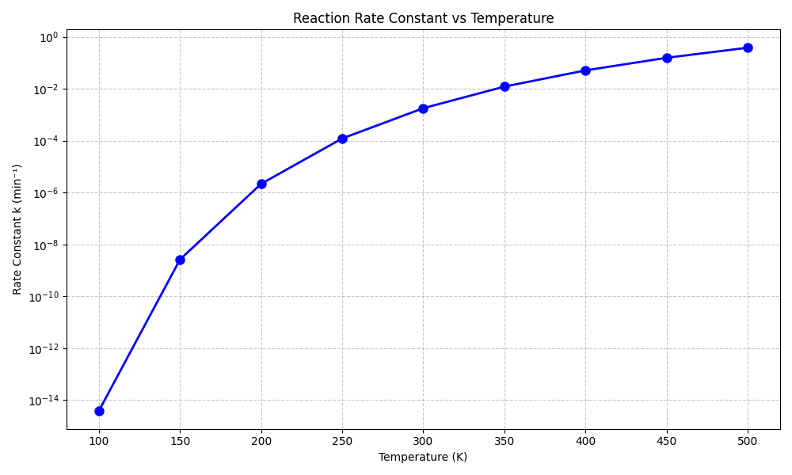

## p5

### Code

```python
   import numpy as np
   
   force = np.array([11, 7, 8, 10, 9])
   k = np.array([1000, 600, 900, 1300, 700])
   
   x = force / k
   energy = k * x**2
   
   a = [round(float(val), 6) for val in x]
   b = [round(float(val), 6) for val in energy]
   
   print("(a) Compressions / m:", a)
   print("(b) Potential Energies / J:", b)
```

### Output

> (a) Compressions / m: [0.011, 0.011667, 0.008889, 0.007692, 0.012857]
> (b) Potential Energies / J: [0.121, 0.081667, 0.071111, 0.076923, 0.115714]

## p6

### Code

```
import numpy as np
import matplotlib.pyplot as plt

k0 = 1200  # min^-1
Q = 8000   # cal/mol
R = 1.987  # cal/(mol·K)

temperatures = np.arange(100, 501, 50)

k_values = k0 * np.exp(-Q / (R * temperatures))

plt.figure(figsize=(10, 6))
plt.plot(temperatures, k_values, 'bo-', linewidth=2, markersize=8)
plt.title('Reaction Rate Constant vs Temperature')
plt.xlabel('Temperature (K)')
plt.ylabel('Rate Constant k (min⁻¹)')
plt.grid(True, linestyle='--', alpha=0.7)
plt.yscale('log')
plt.tight_layout()

plt.show()
```

### Output:


