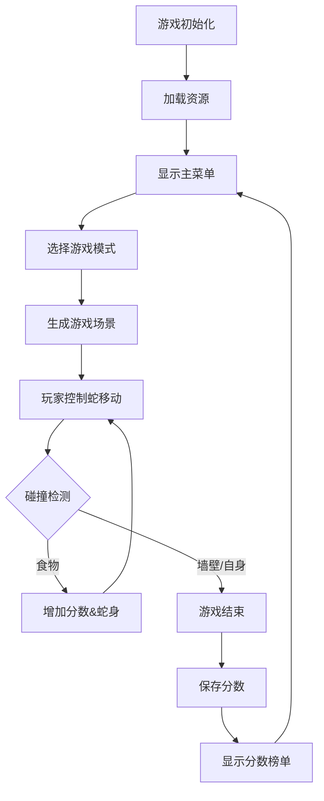
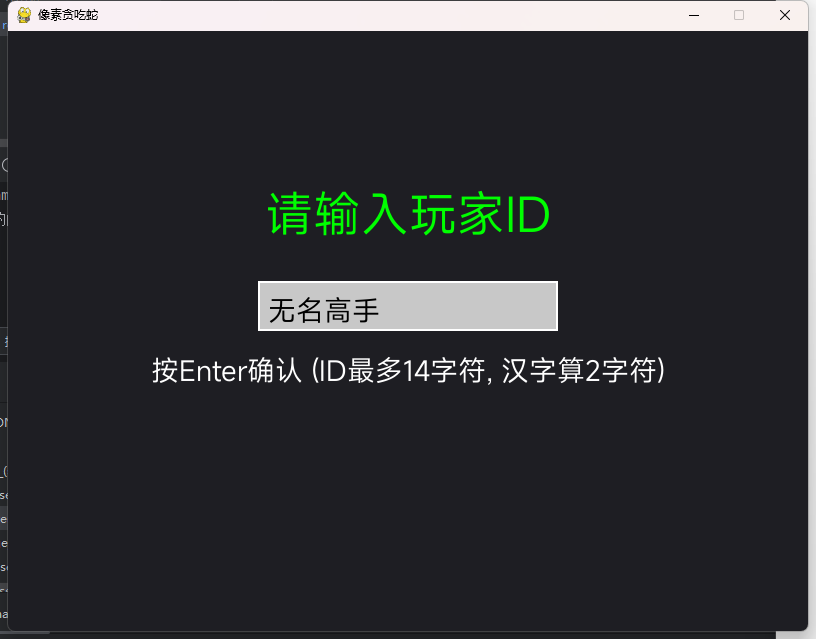
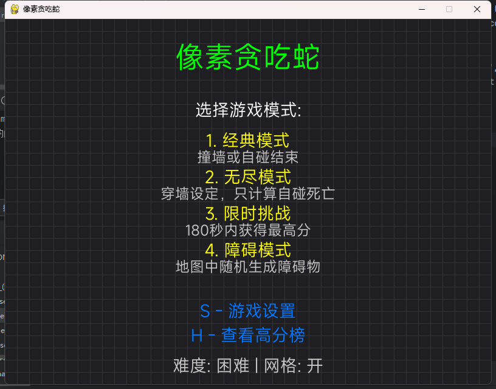
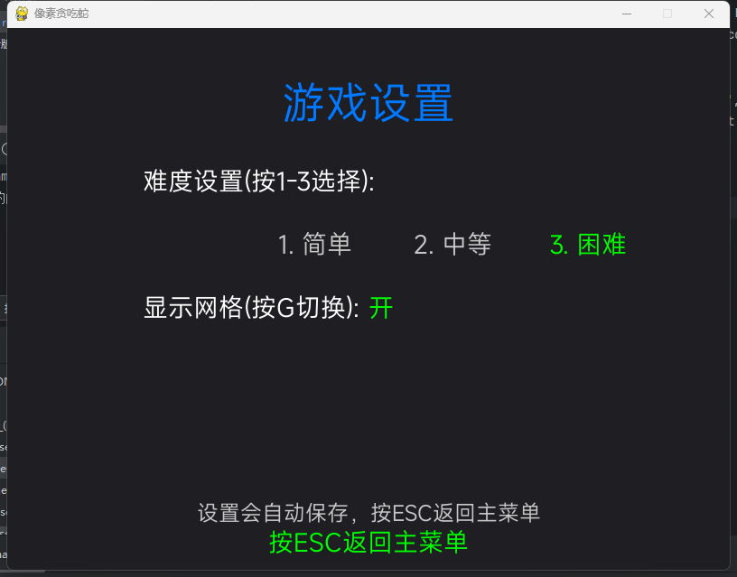
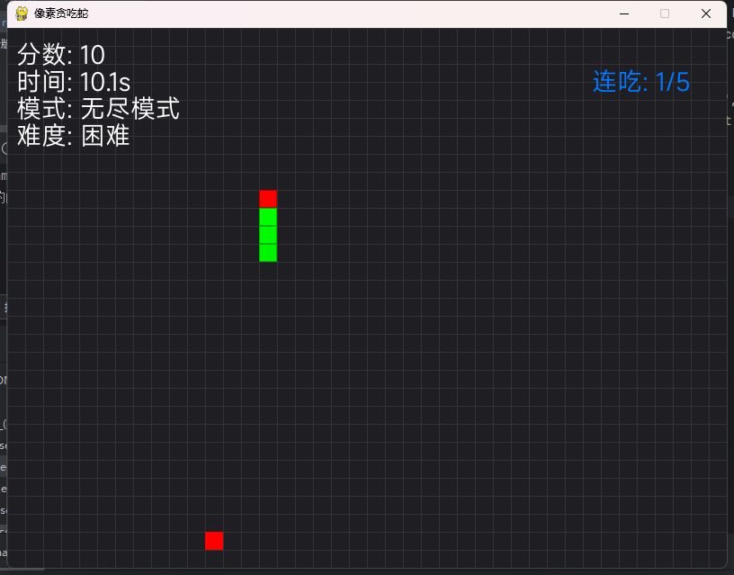
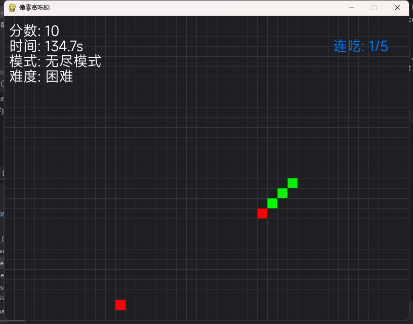
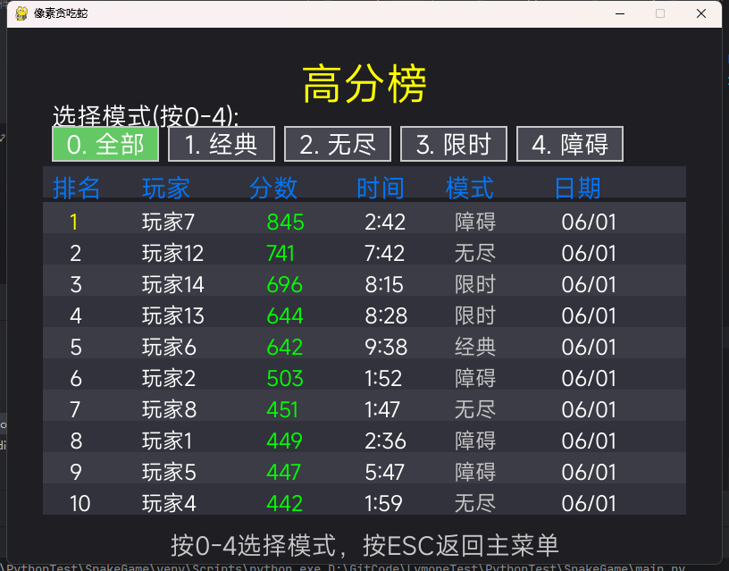

# 像素贪吃蛇

## 1. 游戏概述

- **游戏类型**：经典贪吃蛇游戏的像素风格复刻版
- **核心玩法**：玩家控制蛇移动、吃食物、避免碰撞

## 2. 游戏功能

### 核心功能

- 蛇的移动与控制
- 食物生成与碰撞检测
- 蛇身长度增长机制
- 墙壁和自碰死亡判定
- 暂停/继续游戏功能

### 扩展功能

- 独特设计：
	- 可以采用八向移动，与传统贪吃蛇不完全相同
	- 键位采用键盘WASD+QEZC
	- 在对角移动过程中蛇的身体可以交叉穿过不算做碰撞
- 计分系统：
	- 实时分数显示（每吃1个食物+10分）
	- 连吃奖励（连续吃食物额外加分）
- 计时系统：
	- 游戏时间计时器
	- 限时挑战模式（倒计时模式）
- 分数榜单：
	- 高分榜（Top 10）
	
	- 玩家名称记录
	
	- 按分数排序，相同分数游戏时长短的在上，否则按记录先后顺序
	
	- 每个模式的榜单单独计算
- 游戏设置

    - 难度选择（蛇速度：慢/中/快），不会影响分数
    - 网格显示开关

### 游戏模式

1. **经典模式**：传统玩法，撞墙或自碰结束
2. **无尽模式**：穿墙设定，只计算自碰死亡
3. **限时挑战**：180秒内获得最高分
4. **障碍模式**：地图中会随时间随机生成障碍物

## 3. 游戏界面设计

### 视觉元素

- **蛇**：绿色像素身体 + 红色头部
- **食物**：红色苹果（基础食物） + 金色特殊食物（随机出现）
- **障碍物**：灰色岩石（仅在障碍模式）
- **背景**：深灰色网格

## 4. 游戏逻辑

### 核心逻辑流程



### 关键算法

- **蛇移动**：链表存储身体坐标，移动时头部新增坐标，尾部删除坐标
- **食物生成**：排除蛇身位置的随机坐标生成
- **碰撞检测**：头部坐标与墙壁/自身坐标的比对

## 5. 分数榜单系统

### 数据结构

```
class ScoreEntry:
    player_name: str   # 玩家名称（限制14字母或7字中文）
    score: int         # 游戏得分
    duration: float    # 游戏时长(秒)
    mode: str          # 游戏模式
    date: datetime     # 记录日期
```

### 功能设计

- **数据存储**：使用JSON文件本地存储
- **榜单显示**：
  - 按模式、榜单分类显示Top 10
  - 显示玩家名称、分数、游戏时长、日期

## 6. 计时与计分系统

### 计分规则

- 普通食物：+10分
- 特殊食物：+50分
- 连吃奖励：连续吃5个食物额外+100分
- 时间奖励：限时模式剩余时间转换为分数

### 计时机制

- 实时计时器：显示游戏持续时间
- 限时模式：180秒倒计时
- 时间显示格式：MM:SS

## 7. 技术实现方案

### 依赖库

- **pygame**：图形渲染、音效、输入处理
- **JSON**：分数数据存储
- **datetime**：时间记录

### 文件结构

```
SnakeGame/
├── assets/				# 游戏资产
├── scores.json     	# 分数记录
├── setting.json		# 记录游戏设置
└── main.py            	# 主程序
```

### 性能优化

- 使用缓冲避免画面闪烁
- 坐标计算使用整数运算
- 音效预加载减少延迟

## 8.使用说明

### 0.运行准备

需要安装pygame库，在命令行运行：

```powershell
pip install pygame
```

### 1.运行游戏

运行main.py

### 2.选择模式



编辑ID完成回车进入主菜单



注意需要切换**英文键盘**，以免输入法干扰输入，无法控制

按下`1`、`2`、`3`、`4`可以进入对应的模式，各模式特点在主界面有描述

按下`S`可以查看游戏的设置界面

按下`H`可以进入高分榜

### 3.设置

在主界面按下`S`后进入



按`1`、`2`、`3`切换难度，这个难度只会影响蛇的速度不影响游戏得分

按下`G`可以开关网格，只影响画面不会影响游戏判定

按下`ESC`可以回到主菜单

#### 4.主要游戏界面



左上角HUD会显示当前的分数、游戏时间、游戏模式、游戏难度

右上角HUD会显示特殊提示，如连吃计数、倒计时

在这里可以使用`W`、`A`、`S`、`D`控制蛇头的上下左右移动

特殊的，这款游戏可以使用`Q`、`E`、`Z`、`C`控制蛇头向对角方向移动



### 5.高分榜

在主界面按下`H`键后进入



这里会显示这款游戏在本地的游戏记录（只显示每个模式的前十名）

每个玩家（按照玩家名区分）在一个分榜单上只会有一个名字

按下按键`0`、`1`、`2`、`3`、`4`可以切换榜单

按下`ESC`可以回到主菜单
