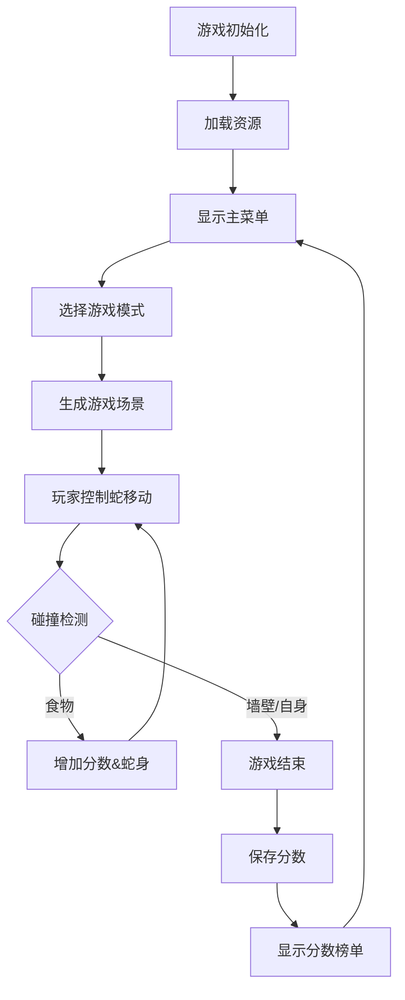

# 像素贪吃蛇

## 1. 游戏概述

- **游戏类型**：经典贪吃蛇游戏的像素风格复刻版
- **核心玩法**：玩家控制蛇移动、吃食物、避免碰撞

## 2. 游戏功能

### 核心功能

- 蛇的移动与控制（键盘方向键/WASD）
- 食物生成与碰撞检测
- 蛇身长度增长机制
- 墙壁和自碰死亡判定
- 暂停/继续游戏功能

### 扩展功能

- 独特设计：
	- 可以采用八向移动，与传统贪吃蛇不完全相同
	- 在对角移动过程中蛇的身体可以交叉穿过不算做碰撞
	
- 音乐与音效系统：
	- 背景音乐（游戏进行中）
	- 音效：吃食物、碰撞死亡、游戏开始/结束
	- 音量调节选项（在顶部工具栏）
	
- 计分系统：
	- 实时分数显示（每吃1个食物+10分）
	- 连吃奖励（连续吃食物额外加分）
	
- 计时系统：
	- 游戏时间计时器
	- 限时挑战模式（倒计时模式）
	
- 分数榜单：
	- 显示高分榜（Top 10）
	
	  - 实际记录所有的玩家
	
	- 玩家名称记录
	
	  - 每次结束都会要求填写ID（限制14字符，汉字算2字符）
	  - 如果选择再来一次则会覆盖上次的记录无需填写ID
	
	- 按分数排序，相同分数游戏时长短的在上，否则按记录先后顺序
	
	- 每个模式的榜单单独计算
	
- 游戏设置

    - 难度选择（蛇速度：慢/中/快）
      - 这个选项是额外的，不会影响分数
    - 网格显示开关
    - 自定义控制按键

- 暂停菜单

    - 游戏暂停时显示帮助信息
    - 提供退出选项，直接结束本局游戏并记录

### 游戏模式

1. **经典模式**：传统玩法，撞墙或自碰结束
2. **无尽模式**：穿墙设定，只计算自碰死亡
3. **限时挑战**：180秒内获得最高分
   - 这个模式内会刷新多个食物，特殊食物概率提高
4. **障碍模式**：地图中会随时间随机生成障碍物

## 3. 游戏界面设计

### 视觉元素

- **蛇**：绿色像素身体 + 红色头部
- **食物**：红色苹果（基础食物） + 金色特殊食物（随机出现）
- **障碍物**：灰色岩石（仅在障碍模式）
- **背景**：深灰色网格

## 4. 游戏逻辑

### 核心逻辑流程



### 关键算法

- **蛇移动**：链表存储身体坐标，移动时头部新增坐标，尾部删除坐标
- **食物生成**：排除蛇身位置的随机坐标生成
- **碰撞检测**：头部坐标与墙壁/自身坐标的比对
- **特殊食物**：每10个普通食物后出现，存在时间5秒（+50分）

## 5. 音频系统设计

### 音效列表

| 音效类型       | 触发时机          | 音效               |
| :------------- | :---------------- | :----------------- |
| 背景音乐       | 游戏进行中        | ./assets/bgm.mp3   |
| 吃食物音效     | 吃到普通食物      | ./assets/ding.mp3  |
| 吃特殊食物音效 | 吃到特殊食物      | ./assets/rare.mp3  |
| 死亡音效       | 蛇死亡时          | ./assets/lose.mp3  |
| 按钮音效       | 菜单选择/按钮点击 | ./assets/press.mp3 |

### 音频管理

- 使用`pygame.mixer`模块管理音频
- 独立音量控制：背景音乐和音效可以分开设置音量
- 静音切换功能(背景音乐和音效都设为0)

## 6. 分数榜单系统

### 数据结构

```
class ScoreEntry:
    player_name: str   # 玩家名称（限制14字母或7字中文）
    score: int         # 游戏得分
    duration: float    # 游戏时长(秒)
    mode: str          # 游戏模式
    date: datetime     # 记录日期
```

### 功能设计

- **数据存储**：使用JSON文件本地存储
- **榜单显示**：
  - 按模式、榜单分类显示Top 10
  - 显示玩家名称、分数、游戏时长、日期
- **新记录识别**：玩家破纪录时特殊标记

## 7. 计时与计分系统

### 计分规则

- 普通食物：+10分
- 特殊食物：+50分
- 连吃奖励：连续吃5个食物额外+100分
- 时间奖励：限时模式剩余时间转换为分数

### 计时机制

- 实时计时器：显示游戏持续时间
- 限时模式：180秒倒计时
- 时间显示格式：MM:SS

## 8. 其他功能

- 

## 9. 技术实现方案

### 依赖库

- **pygame**：图形渲染、音效、输入处理
- **JSON**：分数数据存储
- **datetime**：时间记录

### 文件结构

```
SnakeGame/
├── assets/				# 音效和其他资产
├── scores.json     	# 分数记录
├── game.py            	# 主程序
├── snake.py           	# 蛇类实现
└── scoreboard.py      	# 分数榜管理
```

### 性能优化

- 使用缓冲避免画面闪烁
- 坐标计算使用整数运算
- 音效预加载减少延迟

